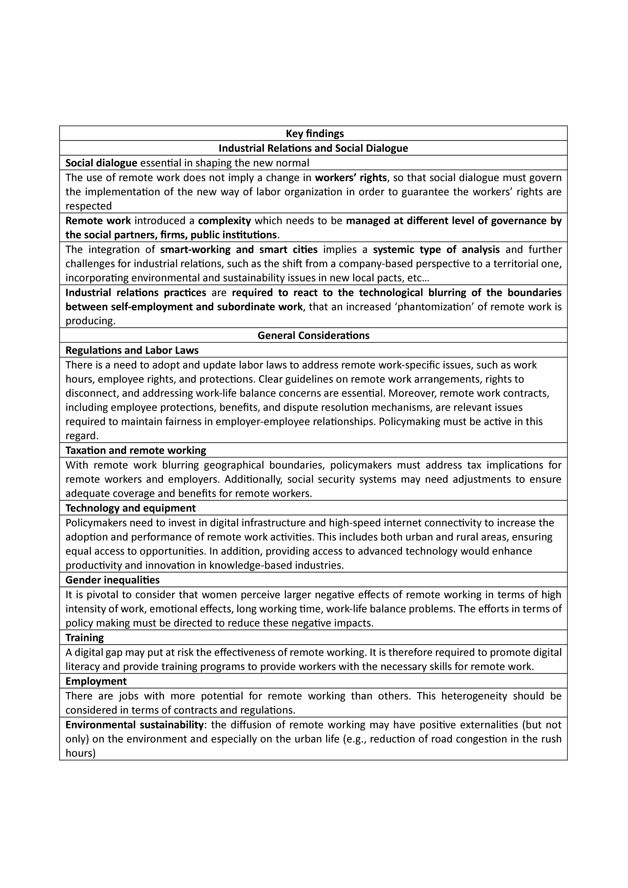

The present post shows the main results of the IRsmart (Industrial Relations for Smart-Workers in Smart Cities) project. A project led by me [UNIFE](https://www.unife.it/it), co-funded by the European Union and involving the following great partners: from France, [Ultra Laborans](https://ultralaborans.org/) (ex ASTREES); from Spain, [INGENIO](https://www.ingenio.upv.es/en); from Italy, [IRES Emilia-Romagna](https://ireser.it/it_it/); from Poland, [Institute of Public Affairs](https://www.isp.org.pl/en); from Romania, [UAIC](https://www.uaic.ro/en/).

The project delved into the diffusion of remote working in Europe, during and immediately after the Covid-19 pandemic and its consequences on workers, firms and territories (cities), with a peculiar perspective that involved the role of industrial relations in managing such a major phenomenon occurred on the labour markets.

The below table synthesize the main results the project achieved both through the industrial relations lens and in general terms, with some policy implications embedded in the results themselves.

In order to access the full materials please visit the official site of the [IRsmart project](https://www.irsmart.eu/). Here the interested reader can find the reports for each work-package and interesting maps on the 'remotability' capacity/potential of the territories of the five partners countries.
